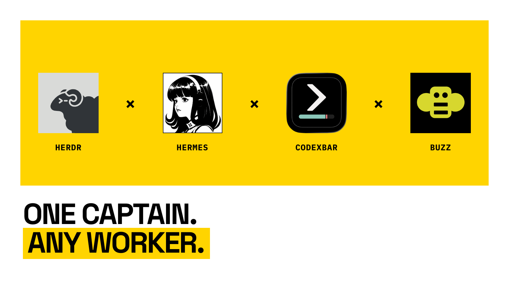

# Thin Herdr captain

A small policy and eval suite for leading cheaper coding models through official Herdr without spending more tokens on orchestration than on the work.

## What this repository owns

- the captain decision rule;
- a compact worker bridge;
- model/harness preferences;
- correctness and token-efficiency gates;
- an optional, measured Headroom trial.

Official [Herdr](https://github.com/herdrdev/herdr) owns terminal, pane, agent, wait, and timeout mechanics. This project intentionally has no dispatcher, watcher, proxy manager, Herdr wrapper, or installer that rewrites agent homes.

## Operating contract

1. Work directly unless delegation has clear net value.
2. Delegate one finished, verifiable deliverable to one worker by default.
3. Prefer cheap/free workers through OpenCode; use Cline as an alternate free lane and GPT through Pi only when justified.
4. Send one prompt, wait on state, verify once.
5. Allow at most one concrete repair after failed verification.
6. Report the result and checks without narration or ceremony.

The complete always-loaded policy is [AGENTS.md](AGENTS.md). It stays short; Herdr mechanics remain in the official skill printed by:

```bash
herdr --skill
```

## Worker bridge

```text
role=worker; outcome=<finished result>
write=<exact paths; all others read-only>
avoid=<non-goals and external-action limits>
accept=<commands or observable checks>
return=done|blocked; paths=<paths>; checks=<checks>; blocker=<reason>; stop
```

Keep the whole prompt at or below 700 characters. Planning, discovery, status reporting, and duplicate attempts are not separate workers.

## Headroom: trial, not dependency

[Headroom](https://github.com/headroomlabs-ai/headroom) may reduce context sent to workers, but a proxy can also add latency and failure modes. It therefore starts outside the control plane and outside the captain path.

Initial candidate:

```bash
headroom wrap opencode --no-mcp --no-serena
```

Do not enable it globally. Run the five-case A/B protocol in [evals/README.md](evals/README.md) first. Adoption requires:

- identical acceptance results on every case;
- at least 20% aggregate uncached-input savings;
- at most 10% aggregate wall-time regression;
- one worker prompt and zero retries per candidate run;
- no persistent configuration mutation;
- concurrent sessions survive one owner exiting;
- direct execution remains available after the proxy stops.

Codex, Pi, Cline, Hermes, and the user-facing captain require separate trials. Passing OpenCode does not approve them automatically.

## Verify

```bash
bash scripts/verify.sh
python3 evals/score_trial.py path/to/results.json
```

The scorer exits zero only when every adoption gate passes. A passing unit test proves the scorer works; only real provider receipts and acceptance commands prove Headroom saves tokens for your workload.

## Design references

- [Herdr](https://github.com/herdrdev/herdr) — official agent control
- [Firstmate](https://github.com/kunchenguid/firstmate) — liaison/crew and event-driven supervision ideas
- [Caveman](https://github.com/JuliusBrussee/caveman) — terse communication
- [Headroom](https://github.com/headroomlabs-ai/headroom) — optional context compression
